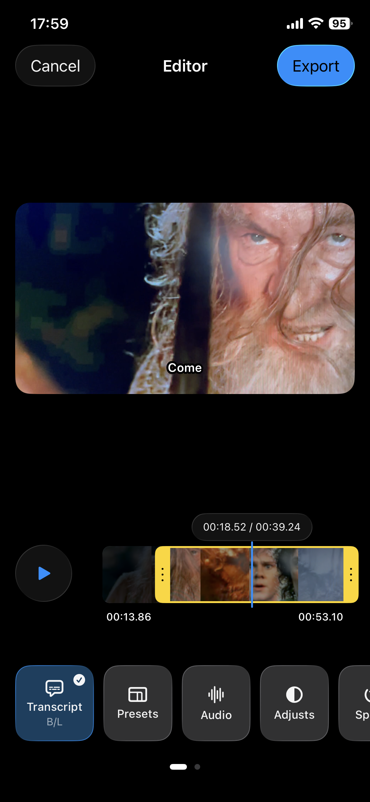
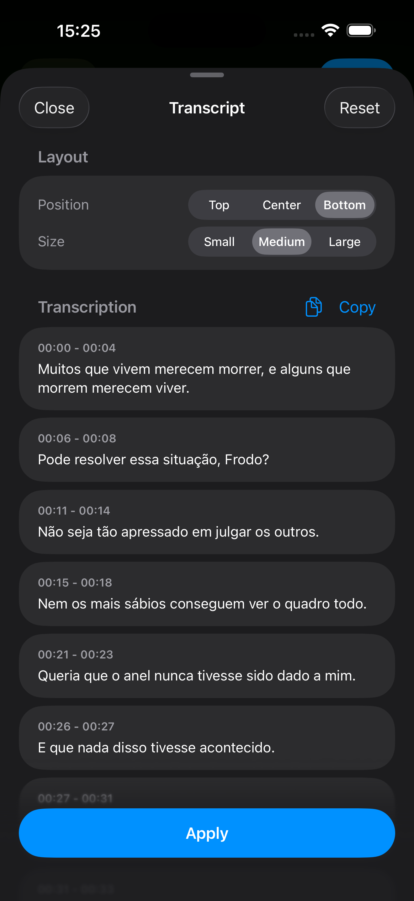
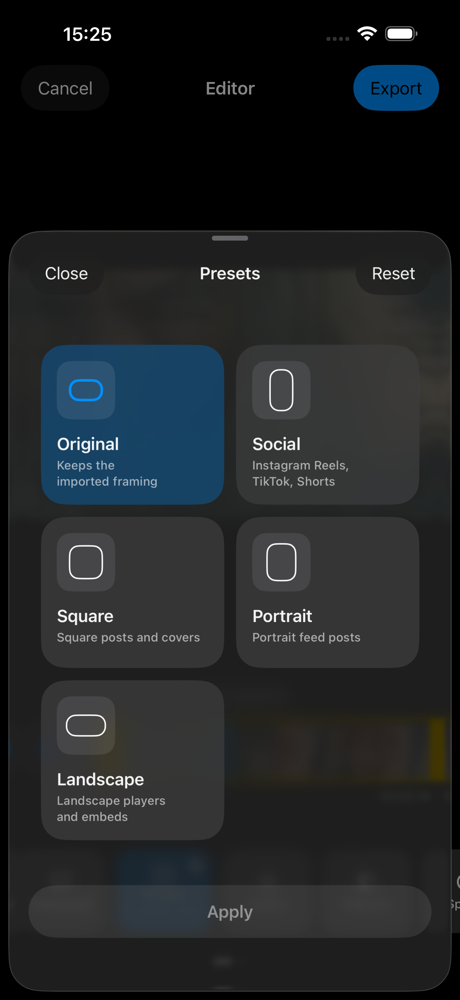
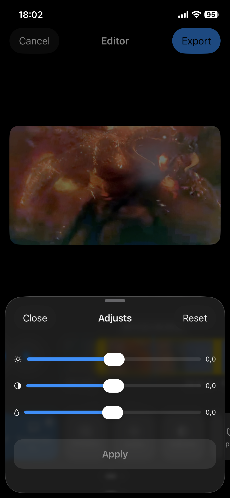
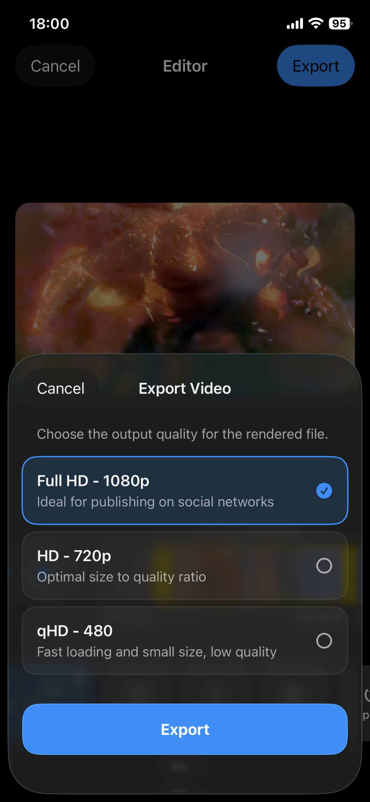

<div align="center">
  <h1>VideoEditorKit</h1>
  <p>
    <a href="./LICENSE">
      
    </a>
    
    
  </p>
</div>

`VideoEditorKit` is a package-first iOS video editor framework built with SwiftUI, Observation, AVFoundation, and PhotosUI.

It currently supports iOS 18.6+ on iPhone only. iPad support is planned and coming soon.

It ships a full-screen editor that already includes trimming, playback speed changes, crop presets, audio recording and mixing, color adjustments, transcript overlays, frame/background styling, and `.mp4` export.

The repository is structured around a Swift Package at the root and an example iOS app in `Example/` that exercises the package as a real integration client.

## What The Framework Provides

- A ready-to-embed SwiftUI editor surface through `VideoEditorView`
- A serializable editing snapshot through `VideoEditingConfiguration`
- Host-controlled feature gating for tools and export qualities
- Manual save callbacks that render an edited copy while preserving the original video
- Optional transcript generation through OpenAI Whisper or a custom `VideoTranscriptionProvider`
- Reusable public canvas, export, transcript, and layout utilities for advanced integrations

## Screenshots

<div align="center">
  
  
  
  
  
</div>

## Requirements

- iOS 18.6+ on iPhone
- iPad support coming soon
- Swift 6
- Xcode with Swift Package Manager support

## Installation

### Swift Package Manager in Xcode

1. Open your app project in Xcode.
2. Go to `File > Add Package Dependencies...`.
3. Paste the repository URL:

```text
https://github.com/didisouzacosta/VideoEditorKit.git
```

4. Add the `VideoEditorKit` library product to your app target.

### Swift Package Manager in `Package.swift`

```swift
dependencies: [
    .package(
        url: "https://github.com/didisouzacosta/VideoEditorKit.git",
        branch: "main"
    )
],
targets: [
    .target(
        name: "MyApp",
        dependencies: [
            .product(name: "VideoEditorKit", package: "VideoEditorKit")
        ]
    )
]
```

## Quick Start

```swift
import SwiftUI
import VideoEditorKit

struct EditorHostView: View {

    @State private var savedConfiguration = VideoEditingConfiguration.initial
    @State private var savedEditedVideoURL: URL?
    @State private var exportedVideoURL: URL?

    let sourceVideoURL: URL

    var body: some View {
        VideoEditorView(
            "Editor",
            sourceVideoURL: sourceVideoURL,
            editingConfiguration: savedConfiguration,
            configuration: .init(
                tools: ToolAvailability.enabled(ToolEnum.all),
                exportQualities: ExportQualityAvailability.allEnabled
            ),
            onSaveStateChanged: { saveState in
                savedConfiguration = saveState.editingConfiguration
            },
            onSavedVideo: { savedVideo in
                savedConfiguration = savedVideo.editingConfiguration
                savedEditedVideoURL = savedVideo.url
            },
            onDismissed: { latestConfiguration in
                if let latestConfiguration {
                    savedConfiguration = latestConfiguration
                }
            },
            onExportedVideoURL: { url in
                exportedVideoURL = url
                print("Exported video:", url)
            }
        )
    }
}
```

## Transcription Setup

Transcript generation is optional. `VideoEditorKit` only enables the transcript flow when you provide a `VideoEditorConfiguration.TranscriptionConfiguration`.

If you do not inject a provider, the editor still works normally for trimming, crop, audio, adjustments, and export, but transcript generation will stay unavailable for that session.

### Option 1: Use The Built-In OpenAI Whisper Integration

The package ships with a convenience factory for OpenAI Whisper:

```swift
let configuration = VideoEditorConfiguration(
    transcription: .openAIWhisper(
        apiKey: "YOUR_OPENAI_API_KEY"
    )
)
```

Then create the transcription configuration directly in your host app:

```swift
let editorConfiguration = VideoEditorConfiguration(
    tools: ToolAvailability.enabled(ToolEnum.all),
    exportQualities: ExportQualityAvailability.allEnabled,
    transcription: .openAIWhisper(
        apiKey: "YOUR_OPENAI_API_KEY"
    )
)
```

Recommended host-side setup:

1. Pass the API key directly when building `VideoEditorConfiguration`.
2. Keep the real key out of source control.
3. Do not rely on `Info.plist` key lookup for transcript setup.
4. Optionally set `preferredLocale` when you want to bias recognition toward a known language.

### Option 2: Inject Your Own Transcription Provider

If you already have a speech-to-text backend, implement `VideoTranscriptionProvider` and inject it directly:

```swift
import Foundation
import VideoEditorKit

struct MyTranscriptionProvider: VideoTranscriptionProvider {

    func transcribeVideo(
        input: VideoTranscriptionInput
    ) async throws -> VideoTranscriptionResult {
        switch input.source {
        case let .fileURL(fileURL):
            _ = fileURL

            return VideoTranscriptionResult(
                segments: [
                    TranscriptionSegment(
                        id: UUID(),
                        startTime: 0,
                        endTime: 2.4,
                        text: "Hello from my custom provider",
                        words: [
                            TranscriptionWord(
                                id: UUID(),
                                startTime: 0,
                                endTime: 0.8,
                                text: "Hello"
                            )
                        ]
                    )
                ]
            )
        }
    }
}
```

Inject it like this:

```swift
let editorConfiguration = VideoEditorConfiguration(
    transcription: .init(
        provider: MyTranscriptionProvider(),
        preferredLocale: "en"
    )
)
```

### What Your Provider Must Return

For the best editing and export experience, your provider should return:

- segment-level timing through `TranscriptionSegment`
- word-level timing through `TranscriptionWord` whenever available
- stable, correctly ordered timestamps in seconds
- text that matches the spoken timeline closely enough for overlay playback and export

### Practical Notes

- `preferredLocale` is forwarded to the active provider. Use it when Apple Speech or your backend supports locale hints.
- The source passed into the provider is a local file URL via `VideoTranscriptionSource.fileURL`.
- Word timings are strongly recommended because they improve transcript overlay behavior.
- If the provider returns no timed segments, the transcript tool will not have usable caption content to edit or render.
- If you use OpenAI in production, route the credential through your app configuration or backend strategy rather than hardcoding it in source files.

## Configuration Reference

This section is the host-app configuration guide for `VideoEditorKit`. If you are deciding what to pass into `VideoEditorView`, start here.

### `VideoEditorConfiguration`

This is the main runtime configuration object for the editor.

```swift
let configuration = VideoEditorConfiguration(
    tools: ToolAvailability.enabled(ToolEnum.all),
    exportQualities: ExportQualityAvailability.allEnabled,
    transcription: .init(),
    maximumVideoDuration: nil,
    onBlockedToolTap: nil,
    onBlockedExportQualityTap: nil
)
```

Each parameter controls a different part of the host integration:

- `tools`: which tools appear in the editor tray, whether they are interactive, and in which order they are shown.
- `exportQualities`: which export options appear in the export sheet, whether they are interactive, and in which order they are shown.
- `transcription`: whether transcript generation is available, which provider is used, and which locale hint should be forwarded.
- `maximumVideoDuration`: optional source-duration limit in seconds. When `nil`, no extra host-side duration cap is enforced.
- `onBlockedToolTap`: callback invoked when a tool is visible but intentionally blocked, useful for paywalls or upgrade flows.
- `onBlockedExportQualityTap`: callback invoked when an export quality is visible but blocked, useful for premium export gating.

Use `VideoEditorConfiguration.allToolsEnabled` when you want the package defaults without any gating.

### `ToolAvailability`

`ToolAvailability` configures one tool entry in the tray.

```swift
let tools: [ToolAvailability] = [
    .enabled(.transcript),
    .enabled(.presets),
    .blocked(.audio),
    .enabled(.adjusts),
    .enabled(.speed)
]
```

Each entry contains:

- `tool`: the `ToolEnum` case being configured.
- `access`: `.enabled` or `.blocked`.
- `order`: the visual order in the tray.

Blocked tools stay visible but are not usable. That makes them a good fit for feature previews and monetization flows.

Available public tool identifiers today are:

- `.transcript`
- `.presets`
- `.audio`
- `.adjusts`
- `.speed`
- `.cut`

`ToolEnum.all` returns the default set used by the package UI. At the moment it intentionally excludes `.cut` from that convenience list, so include `.cut` manually if your host wants to control it explicitly.

### `ExportQualityAvailability`

`ExportQualityAvailability` works the same way as tool gating, but for export choices.

```swift
let exportQualities: [ExportQualityAvailability] = [
    .enabled(.low),
    .blocked(.medium),
    .blocked(.high)
]
```

Each entry contains:

- `quality`: the `VideoQuality` case being configured.
- `access`: `.enabled` or `.blocked`.
- `order`: the order shown in the export sheet.

Useful convenience presets:

- `ExportQualityAvailability.allEnabled`: every quality enabled.
- `ExportQualityAvailability.premiumLocked`: low enabled, medium and high blocked.

### `VideoQuality`

`VideoQuality` defines the export profile that the package uses.

- `.low`: `854x480`
- `.medium`: `1280x720`
- `.high`: `1920x1080`

The type also exposes user-facing titles, subtitles, target frame rate, and render sizes for portrait or landscape exports. In most host apps, you will only need to decide which qualities are visible and enabled.

### `VideoEditorConfiguration.TranscriptionConfiguration`

This nested configuration enables transcript generation.

```swift
let transcription = VideoEditorConfiguration.TranscriptionConfiguration(
    provider: myProvider,
    preferredLocale: "en"
)
```

Its fields are:

- `provider`: any `VideoTranscriptionProvider` implementation. If `nil`, transcript generation is unavailable for that session.
- `preferredLocale`: optional locale hint forwarded into the provider input.

You can also build it with:

```swift
let transcription = VideoEditorConfiguration.TranscriptionConfiguration.openAIWhisper(
    apiKey: resolvedOpenAIAPIKey(),
    preferredLocale: "en"
)
```

### `VideoEditorSession`

`VideoEditorSession` defines one editor run.

```swift
let session = VideoEditorSession(
    source: .fileURL(sourceVideoURL),
    editingConfiguration: savedConfiguration
)
```

Its fields are:

- `source`: where the video comes from.
- `editingConfiguration`: the previously saved `VideoEditingConfiguration` used to resume work.

Use a session when the host wants to restore an existing project or resolve the source asynchronously.

### `VideoEditorSessionSource`

This enum defines how the editor receives a video:

- `.fileURL(URL)`: use this when the video is already available locally.
- `.importedFile(VideoEditorImportedFileSource)`: use this when the host must finish an async import step before the editor can open the file.

If you already have a local file URL, `sourceVideoURL:` is the simplest `VideoEditorView` initializer. Reach for `VideoEditorSessionSource` when you need more control.

### `VideoEditorImportedFileSource`

This type wraps an async resolver used by `.importedFile`.

```swift
let importedSource = VideoEditorImportedFileSource(
    taskIdentifier: assetID
) {
    try await importer.resolveLocalVideoURL()
}
```

Its fields are:

- `taskIdentifier`: stable identifier for the import task. The editor uses it to distinguish one source-loading job from another.
- `resolveURL`: async closure that must return a local file URL the editor can open.

Use this when your app imports from cloud storage, a document picker, a temporary sandbox copy, or another async asset pipeline.

### `VideoEditorCallbacks`

`VideoEditorCallbacks` groups the host lifecycle closures:

- `onSaveStateChanged`: emitted after manual save with the latest `VideoEditorSaveState`.
- `onSavedVideo`: called after manual save renders an edited copy at the source resolution and frame rate.
- `onSourceVideoResolved`: called when an async source finishes resolving into a local URL.
- `onDismissed`: called when the editor closes, returning the latest available editing snapshot.
- `onExportedVideoURL`: called after a successful export.

You can pass callbacks through the convenience `VideoEditorView` initializer or construct `VideoEditorCallbacks` directly when using the `session:` initializer.

### `VideoEditorSaveState`

This is the save-state payload emitted by `onSaveStateChanged` after an explicit manual save. It is no longer an autosave stream for every edit action.

Its fields are:

- `editingConfiguration`: the serializable editor snapshot that was saved.
- `thumbnailData`: optional thumbnail data representing the saved project state.
- `continuousSaveFingerprint`: normalized snapshot used by the editor to ignore transient UI/playback state when tracking unsaved changes.

For most integrations, persist the richer `SavedVideo` payload from `onSavedVideo` and use this value when you only need the latest saved configuration or thumbnail.

### `SavedVideo`

This is the manual save payload emitted by `onSavedVideo`.

Its fields are:

- `url`: file URL of the rendered edited copy.
- `originalVideoURL`: file URL of the original source video that should remain preserved by the host.
- `editingConfiguration`: the saved editing snapshot applied to the edited copy.
- `thumbnailData`: optional thumbnail data for the saved edit.
- `metadata`: size, duration, and file metadata for the saved edited copy.

Manual save renders the current edit without changing the source resolution or source frame rate when that frame timing is available. The host should store the original video and saved edited copy separately.

### `VideoEditingConfiguration`

`VideoEditingConfiguration` is the package's persisted editing snapshot. It is the main value you save after explicit manual save and the main value you pass back when resuming later.

Use it for:

- restoring trim and playback decisions
- restoring crop and visual adjustments
- restoring transcript editing state
- restoring audio and other editor choices across launches

For most host apps, the mental model is simple: treat `VideoEditingConfiguration` as the document state, and treat `VideoEditorConfiguration` as the host policy for what the editor is allowed to do.

## Integration Concepts

### `VideoEditorView`

This is the main public entry point. Present it inside a navigation flow, a sheet, or a full-screen cover, and the package handles the editor UI, preview, tools, and export flow.

### `VideoEditorSession`

Use a `VideoEditorSession` when you want the host app to control:

- which source video is edited
- whether the source is already available as a `URL` or must be resolved asynchronously
- whether the editor should start from a previously saved `VideoEditingConfiguration`

### `VideoEditingConfiguration`

This is the package's persistent editing snapshot. Save it in your app when manual save succeeds through `onSavedVideo` or `onSaveStateChanged`, and pass it back into the editor later to resume an existing project.

### `VideoEditorConfiguration`

This is the host-facing runtime configuration for:

- visible and blocked tools
- visible and blocked export qualities
- transcription provider injection
- maximum allowed source duration
- blocked-action callbacks for premium or upsell flows

### `VideoEditorCallbacks`

The callback bundle allows the host app to react to:

- manual save-state publication
- saved edited video publication
- asynchronous source resolution completion
- editor dismissal
- successful export completion

## Installing In A Vibe-Coded (AI-Generated) App

If your app was scaffolded by an AI coding tool, installation is still the normal Swift Package Manager flow.

The easiest path is:

1. Add the package in Xcode first.
2. Make sure your app target links the `VideoEditorKit` product.
3. Ask your coding assistant to import `VideoEditorKit` and present `VideoEditorView`.
4. Persist `SavedVideo` from `onSavedVideo`, keeping the original video and edited copy as separate files.
5. Store `VideoEditingConfiguration` from the saved payload so edits can resume cleanly.
6. Wire `onExportedVideoURL` into your share, save-to-library, or upload flow.

For AI-generated host apps, this prompt usually works well:

```text
Add VideoEditorKit through Swift Package Manager, import VideoEditorKit, present VideoEditorView for a local video URL, persist the SavedVideo payload from onSavedVideo as the manually saved edited copy, keep the original video separately, and keep the exported video URL in host state so the app can share it later.
```

If your generated app already has a media picker, map its result into one of these session sources:

- `VideoEditorSessionSource.fileURL` when you already have a local file
- `VideoEditorSessionSource.importedFile` when the file must be resolved asynchronously

## Public API Guide

The package exposes more than just the main editor view. The public surface is grouped roughly as:

- host integration: `VideoEditorView`, `VideoEditorSession`, `VideoEditorCallbacks`, `VideoEditorConfiguration`
- persisted editing state: `VideoEditingConfiguration` and its nested models
- tool and export gating: `ToolEnum`, `ToolAvailability`, `VideoQuality`, `ExportQualityAvailability`
- canvas and crop helpers: `VideoCanvas*`, `VideoCrop*`
- transcript helpers: `Transcript*`, `VideoTranscriptionProvider`, `EditorTranscript*`
- reusable SwiftUI building blocks: player, timeline, export, canvas, and tool-sheet views

For a full grouped reference of the public API that ships in the module, see [`Sources/VideoEditorKit/VideoEditorKit.docc/VideoEditorKit.md`](Sources/VideoEditorKit/VideoEditorKit.docc/VideoEditorKit.md).

## Current Capabilities

- Import and edit a local video
- Trim a selected playback range
- Change playback speed from `0.1x` to `8.0x`
- Apply crop presets
- Rotate and mirror the video
- Record one extra audio track and mix it with the source track
- Adjust brightness, contrast, and saturation
- Add a colored frame/background treatment
- Track unsaved changes internally and require an explicit manual save
- Save an edited copy while preserving the original video, source resolution, and source frame rate when available
- Export asynchronously to `.mp4`

## Repository Layout

```text
Package.swift
Sources/VideoEditorKit/
Tests/VideoEditorKitTests/
Example/VideoEditor/
Example/VideoEditorTests/
Example/VideoEditor.xcodeproj
Example/VideoEditor.xcworkspace
```

## Development And Validation

This repository is iOS-only. The supported validation flow is iOS Simulator based.

Preferred commands:

```bash
scripts/format-swift.sh
scripts/lint-swift.sh
scripts/test-ios.sh
```

Equivalent `xcodebuild` commands:

```bash
xcodebuild \
  -workspace Example/VideoEditor.xcworkspace \
  -scheme VideoEditorKit-Package \
  -destination 'platform=iOS Simulator,name=iPhone 17' \
  test

xcodebuild \
  -workspace Example/VideoEditor.xcworkspace \
  -scheme VideoEditor \
  -destination 'platform=iOS Simulator,name=iPhone 17' \
  test
```

Open the example app from:

```text
Example/VideoEditor.xcworkspace
```

## Current Architectural Reality

`VideoEditorKit` currently behaves like a package-backed app framework with a monolithic editor flow, not yet like a fully decomposed engine-based SDK.

That means:

- preview and export are conceptually aligned, but not guaranteed by one shared engine
- freeform crop is not fully exported today
- export first saves pending edits and then renders the selected export quality, but the renderer is still not a fully detached export-job engine
- advanced features such as multi-track audio, multi-layer video composition, or normalized subtitle coordinates are not part of the current public contract

[](https://opensource.org/licenses/MIT)
